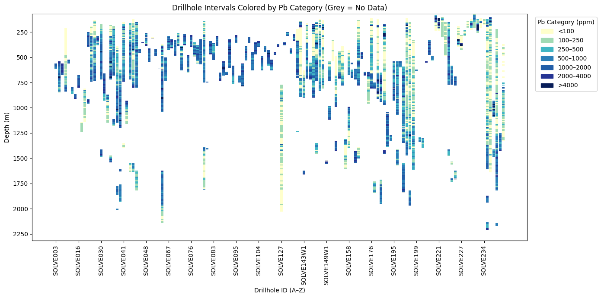
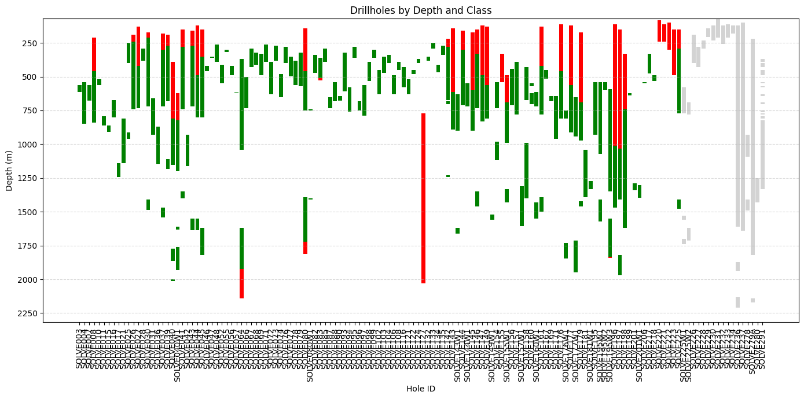
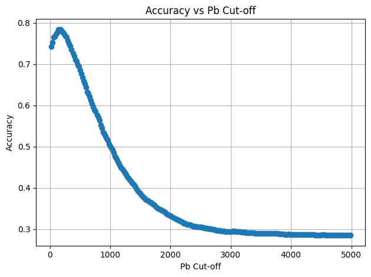
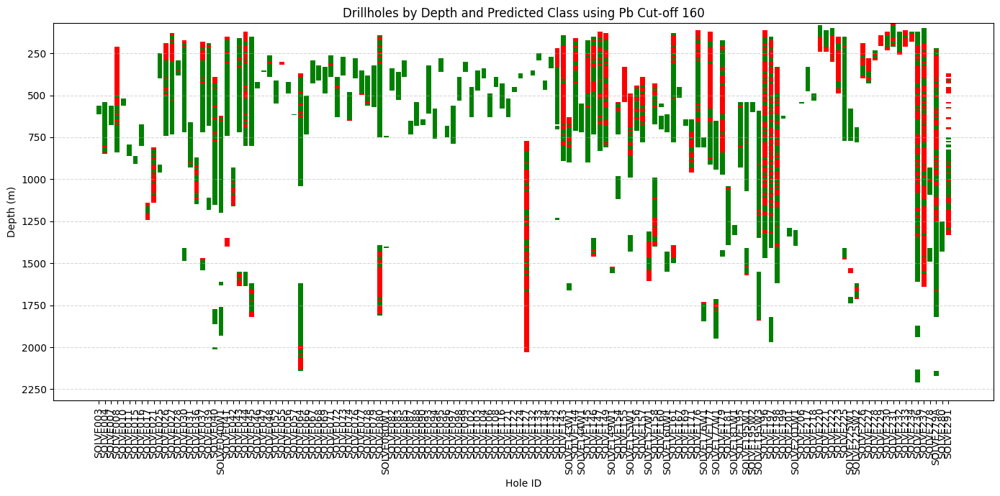
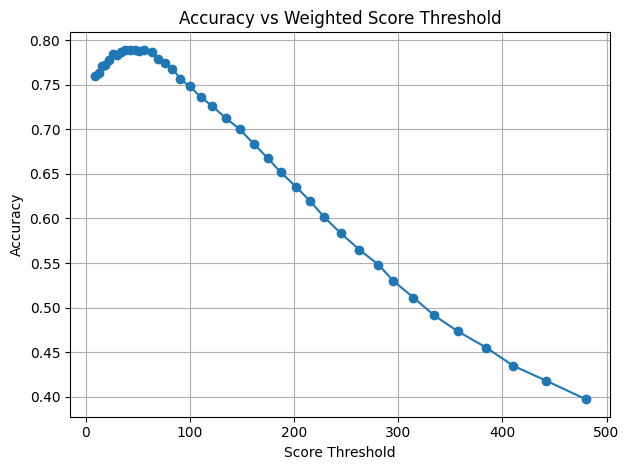
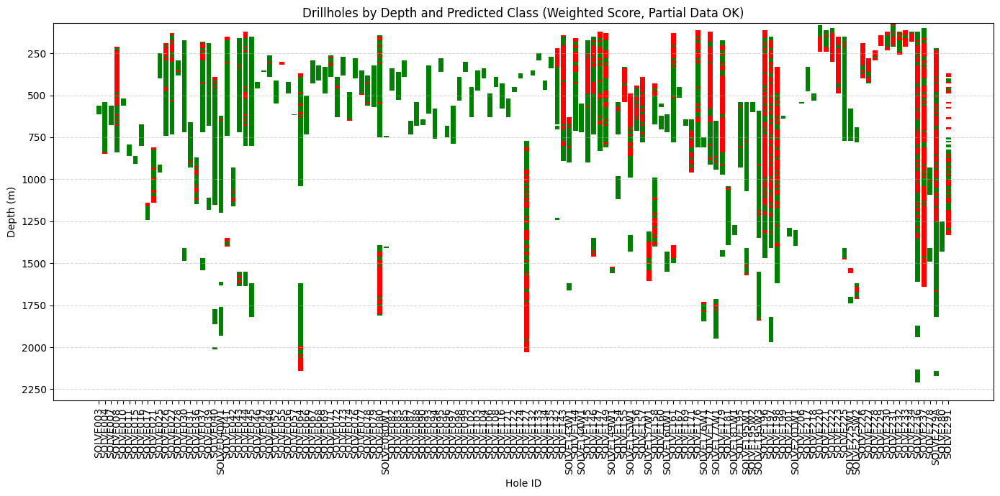
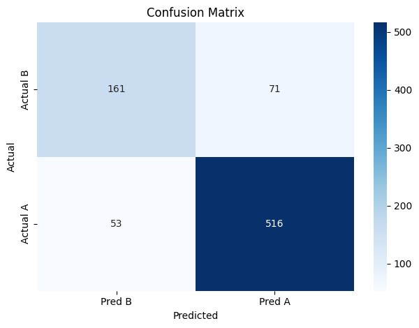
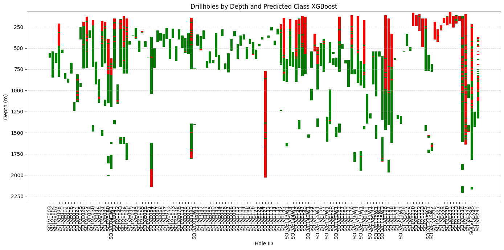
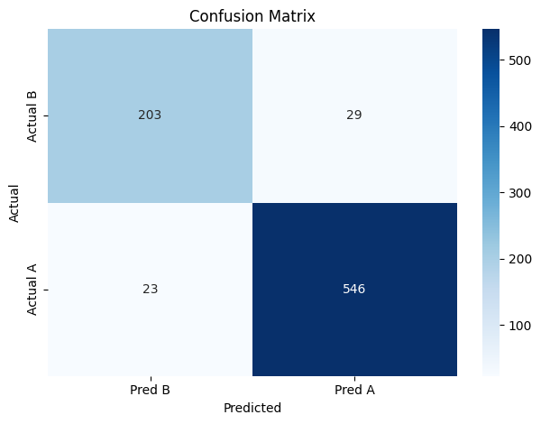
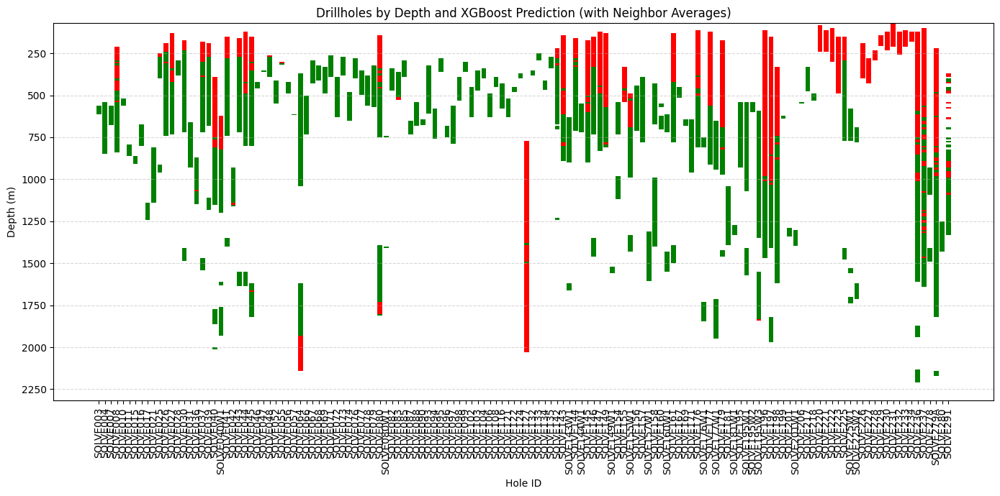

# **Datarock Coding Test**

## Aim

Can we use the same geochemical data and labels to generate a predictive model for future drill holes which can label samples on whether they are in class A or class B?

More data has been acquired since the geochemist completed her work — can we predict labels onto these data points (labelled “?”)?

## Read Data

- Understand its structure and content
- Check for errors, missing values, and outliers
- Clean the data and prepare it for modelling

**Fields (type):**

- `Unique_ID` (object)  
- `holeid` (object)  
- `from` (int64)  
- `to` (float64)  
- `As` (float64)  
- `Au` (object)  
- `Pb` (float64)  
- `Fe` (float64)  
- `Mo` (float64)  
- `S` (float64)  
- `Cu` (float64)  
- `Zn` (float64)  
- `Class` (object)  

**Dataset:**

- 140 Drillholes  
- 4,004 Classified data points  
- 767 Unclassified data points

**Notes:**
- Missing collar coordinates  
- Missing units
- Some missing values (`As` Missing 1503 values)  
- Not all intervals present

**QAQC:**
- Missing collar coordinates  
- Missing units  
- `<0.005` in `Au` replaced with half detection limit `0.0025`  
- `Au` converted from object to float  
- `-999` values removed  
- Some missing values (e.g. in `As`)  
- Not all intervals present

## Visualisation

- Plotted `holeid` along the x-axis and depth on the y-axis  
- Created two versions: one coloured by `Pb`, one by `Class`

>   
> *Figure: Drillholes coloured by Pb values*

>   
> *Figure: Drillholes coloured by known class*

## Analysis

### Pb Cut-off Grade

- Iterated through Pb cut-off values to find the one best aligned with Class  
- Pb = **160** gave the highest accuracy: **78.4%**

>   
> *Figure: Pb cutoff accuracy test*
>
>   
> *Figure: Predicted Classes using Pb cut-off 160*

### Weighted Scoring

- Used a weighted sum of key elements (`Pb`, `Mo`, `Au`, `As`) based on correlation  
- Elements `S`, `Zn`, `Cu`, and `Fe` were excluded due to low correlation  
- Accuracy improved slightly to **78.91%**

>   
> *Figure: Weighted scoring accuracy*
  
>   
> *Figure: Predicted Classes using weighted scoring*

### XGBoost

- Applied XGBoost to model non-linear relationships and interactions  
- Validated using 20% random test split  
- Accuracy improved to **84.52%**

>   
> *Figure: Confusion matrix for XGBoost model*
>
> >   
> *Figure: Predicted classes using XGBoost*

### XGBoost + Depth Intervals

- Added depth interval as an additional parameter to model spatial relationships  
- Final model accuracy: **93.51%**

>   
> *Figure: Predicted classes using XGBoost model with depth intervals*
>
> >   
> *Figure: Predicted classes using XGBoost model with depth intervals*

## Further Improvements

- Apply collar location to plot drillholes in 3D space  
- Validate models by removing entire drillholes instead of random samples  
- Compare with other ML methods (e.g. Random Forest, SVM)  
- Include geological data such as lithology, alteration, and structure
